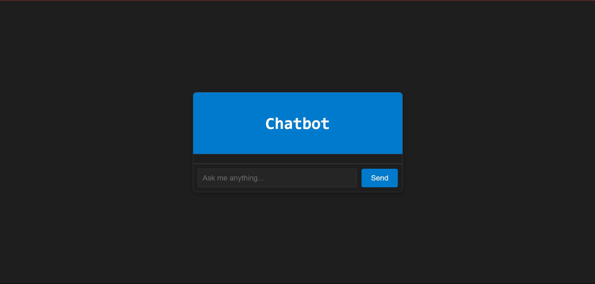

# AI Chatbot

A simple AI chatbot built with HTML, CSS, and JavaScript. This chatbot provides a developer-friendly user interface and responds to user queries based on predefined intents.

## Features

- Clean, developer-centric UI with a dark theme.
- Responsive design for various screen sizes.
- Predefined responses based on user input.
- Easy-to-understand code for customization.

## Demo



## Getting Started

To run the chatbot locally:

1. Clone the repository:
   ```bash
   git clone https://github.com/glowingjellyfishstudio/ai-chatbot.git
   cd ai-chatbot
   ```

2. Open the `chatbot.html` file in your favorite browser.

## Files

- `chatbot.html`: The main HTML structure of the chatbot.
- `chatbot.css`: Styling for the chatbot's user interface.
- `chatbot.js`: JavaScript logic for chatbot functionality.

## Customization

You can add more responses or modify the chatbot logic in `chatbot.js`. To change the appearance, edit the `chatbot.css` file.

## Contributing

Contributions are welcome! Feel free to fork the repository and submit a pull request.
Thanks to https://github.com/copilot/share/48065220-42a0-8474-a102-764a243d00d3

## License

This project is licensed under the MIT License. See the [LICENSE](LICENSE) file for details.

## Contact

For any questions or feedback, please reach out to [glowingjellyfishstudio](https://github.com/glowingjellyfishstudio).